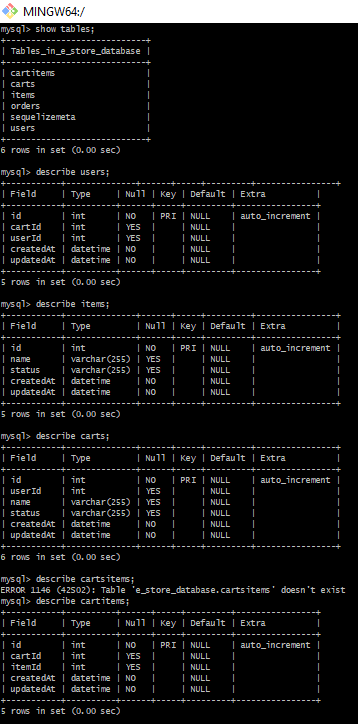
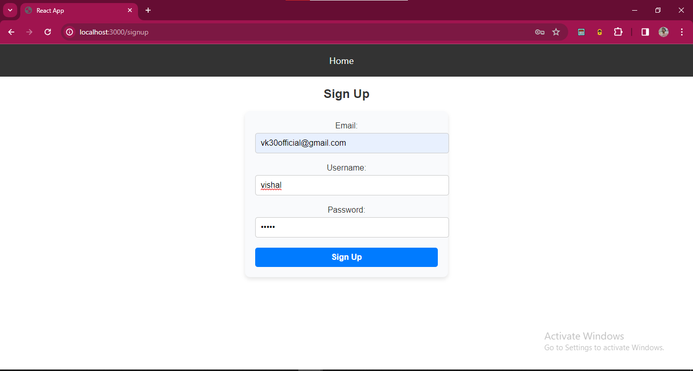
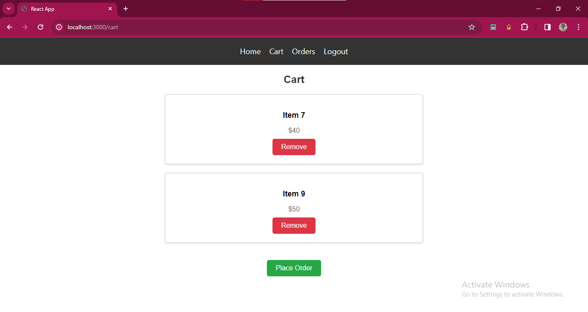
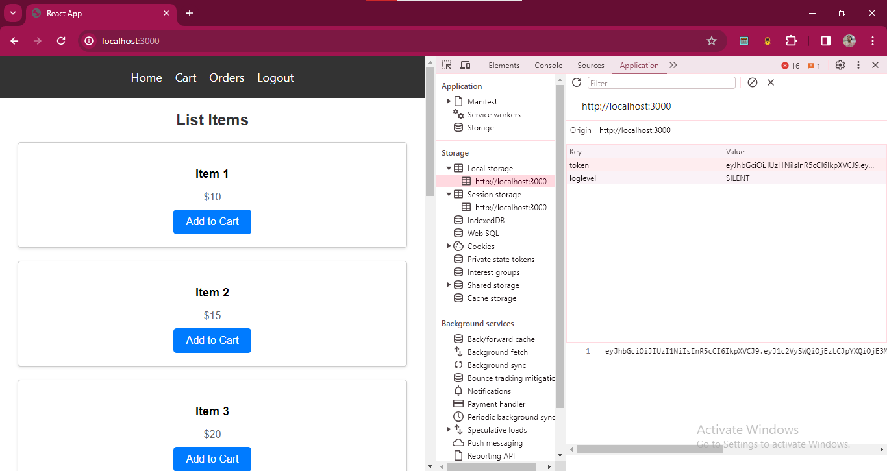

# E-Commerce Website

This project is an E-Commerce website built using React for the client-side and Node.js with Express for the server-side. It is a microservice based architecture we followed MVC pattern

#### Video Link: [Watch the video](https://www.loom.com/share/d88a4db4eae745079022a5ecf210c784?sid=7a66c6c0-c4eb-46cc-b9d4-1c118bd20b69)

## Folder Structure

The project consists of two main folders: `client` and `server`.

### Client

The `client` folder contains all the files related to the front-end of the application.

- **src**: This folder contains the source code of the React application.
  - **components**: Contains reusable React components used throughout the application.
  - **pages**: Contains React components representing different pages of the website.
  - **assets**: Contains static assets such as images, fonts, etc.
  - **App.js**: The main entry point of the React application.
- **public**: Contains the public assets and the HTML template for the React application.

### Server

The `server` folder contains all the files related to the back-end of the application.

- **src**: This folder contains the source code of the Node.js application.
  - **config**: Contains configuration files for the application.
  - **controllers**: Contains controller functions for handling HTTP requests.
  - **models**: Contains database models defined using Sequelize ORM.
  - **routes**: Contains route definitions for different API endpoints.
  - **services**: Contains business logic and utility functions.
  - **index.js**: The main entry point of the Node.js application.

# Installation

- clone the project on your local

### Set up Database

- Download this output_file.sql file any where may be in downloads
- cd downloads
- mysql -u root -p estore <Basic-E-Commerce-Store output_file.sql

### Schema of the Database



### Client

To install the dependencies for the client-side application, navigate to the `client` folder and run the following command:

```
npm install
```

### Server

To install the dependencies for the server-side application, navigate to the `server` folder and run the following command:

```
npm install
```

### Usage

To start the client-side application, run the following command in the `client` folder:

```
npm start
```

To start the server-side application, run the following command in the `server` folder:

```
npm start
```

## SignUp Page



## Login Page


## Items of Store


## Items in the Cart



## Placed Ordered Items


## JWT Token for Authentication


